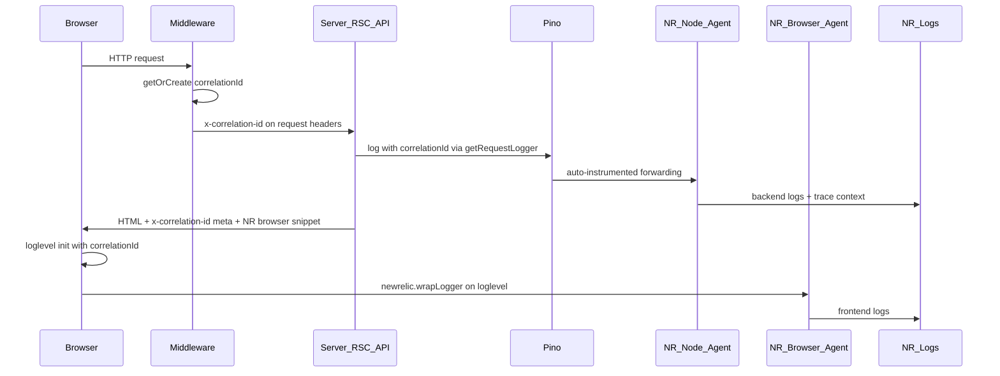

# Complete Logging Architecture for Next.js 16

> **Status:** Implemented. Use this plan to re-apply or audit the work on branch `APP-0005-Logging-NewRelic`.

## Prerequisites before starting

This logging work **builds on LaunchDarkly integration** from `APP-0004-LaunchDarkly-2`. Before implementing logging, ensure the branch includes:

- `nextjsapp/lib/ldConfig.ts`, `ldContext.ts`, `ldFlags.ts`, `ldSecureHash.ts`, `ldServer.ts`
- `nextjsapp/components/LDProviderWrapper.tsx` (base version — logging extends it)
- `nextjsapp/middleware.ts` (LD user cookie)
- `nextjsapp/app/api/ld-secure-hash/route.ts`
- `nextjsapp/app/page.tsx` with flag examples

**Runtime requirement:** New Relic agent `^14.1.0` requires **Node.js >= 22** (`newrelic` package `engines` field). Use `.nvmrc` (`22`), `package.json` `engines`, and `nodejs:22` in `Dockerfile.runtime`.

## Target architecture



## Tool choices

| Layer | Chosen | Why it fits | Alternatives |
|---|---|---|---|
| Frontend logger | **Loglevel** | Tiny, level filtering, easy NR `wrapLogger` integration | Consola, Pino browser |
| Backend logger | **Pino** | Fast structured JSON; NR auto-instruments Pino 7+ | Winston |
| APM + log sink | **New Relic** | Official Next.js 16 example, built-in Pino forwarding | Datadog, OpenTelemetry + Grafana |
| Correlation | **`x-correlation-id` header + cookie + meta tag** | Works across Edge middleware, RSC, API, client | W3C `traceparent` / NR `getTraceMetadata()` |

---

## 1. Dependencies

Add to [`package.json`](nextjsapp/package.json):

```json
"engines": { "node": ">=22" }
```

| Package | Purpose |
|---|---|
| `newrelic` `^14.1.0` | Node APM agent (requires Node >= 22) |
| `pino` `^9.x` | Server structured logging |
| `pino-pretty` (dev) | Pretty stdout in dev |
| `loglevel` + `@types/loglevel` | Client logging |
| `@types/node` `^22` | Types aligned with Node 22 |

Also create [`.nvmrc`](nextjsapp/.nvmrc) with `22`.

Use existing `cross-env` for Windows-safe `NODE_OPTIONS` on `start`.

---

## 2. Correlation ID propagation

**Constants** — [`lib/logging/constants.ts`](nextjsapp/lib/logging/constants.ts):

- `X_CORRELATION_ID = 'x-correlation-id'`
- `CORRELATION_ID_COOKIE = 'correlation_id'` (readable by client JS)

**Pure middleware helper** — [`lib/logging/middlewareCorrelation.ts`](nextjsapp/lib/logging/middlewareCorrelation.ts):

- `applyCorrelationId(request)` — read or generate UUID; return `{ correlationId, requestHeaders }`
- `setCorrelationResponseHeaders(response, correlationId)` — set response header + readable cookie

**Middleware** — [`middleware.ts`](nextjsapp/middleware.ts):

- Call `applyCorrelationId`, forward headers via `NextResponse.next({ request: { headers } })`
- Keep existing LaunchDarkly `ld_user_id` httpOnly cookie logic

**Server helper** — [`lib/logging/correlationId.ts`](nextjsapp/lib/logging/correlationId.ts):

- `getCorrelationIdFromHeaders(headers)` — parse incoming header
- `getCorrelationId()` — async, wraps `headers()` from `next/headers`; fallback UUID on error

**Client access** — [`components/LoggingProvider.tsx`](nextjsapp/components/LoggingProvider.tsx):

- Receives `correlationId` prop from server layout
- Falls back to `<meta name="x-correlation-id">` or `correlation_id` cookie
- Exposes `useLogging()` / `useClientLogger(name)` context hooks

---

## 3. Backend logging (Pino)

### `lib/logging/serverLogger.ts`

- Singleton Pino instance; `pino-pretty` transport in non-production
- `getServerLogBindings(extra?)` — async helper that reads `correlationId` via `getCorrelationId()`

### `lib/logging/getRequestLogger.ts`

```typescript
export async function getRequestLogger(bindings?) {
  return serverLogger.child(await getServerLogBindings(bindings));
}
```

**Usage surfaces** (Node runtime only — not Edge middleware):

- [`app/layout.tsx`](nextjsapp/app/layout.tsx)
- [`app/api/ld-secure-hash/route.ts`](nextjsapp/app/api/ld-secure-hash/route.ts)
- Future server actions — same import

**Edge middleware:** correlation ID only; no Pino.

**NR log forwarding:** enabled in `newrelic.js` via `application_logging.forwarding`. NR auto-instruments Pino 7+ — no `@newrelic/pino-enricher` needed.

---

## 4. Frontend logging (Loglevel)

[`lib/logging/clientLogger.ts`](nextjsapp/lib/logging/clientLogger.ts):

- Level from `NEXT_PUBLIC_LOG_LEVEL` (default `warn` prod / `debug` dev)
- `getClientLogger(name, correlationId)` — named loglevel instance
- When `window.newrelic.wrapLogger` is available, wraps `trace|debug|info|warn|error` with `customAttributes: { correlationId, logger, source: 'client' }`

[`components/LoggingProvider.tsx`](nextjsapp/components/LoggingProvider.tsx) initializes loggers; [`LDProviderWrapper.tsx`](nextjsapp/components/LDProviderWrapper.tsx) uses `getLogger` instead of `console.error` and passes `x-correlation-id` on `/api/ld-secure-hash` fetch.

---

## 5. New Relic Node.js agent (production only)

NR loads on **`next start` and Docker only** — not `next dev` or `next build`.

### `newrelic.js` (project root)

```javascript
exports.config = {
  app_name: [process.env.NEW_RELIC_APP_NAME || "nextjsapp"],
  license_key: process.env.NEW_RELIC_LICENSE_KEY || "",
  distributed_tracing: { enabled: true },
  application_logging: {
    enabled: true,
    forwarding: { enabled: true },
    metrics: { enabled: true },
  },
  logging: { level: "info" },
  allow_all_headers: true,
  attributes: { exclude: [/* cookie/auth/x-* headers */] },
};
```

### Script changes — [`package.json`](nextjsapp/package.json)

| Script | Behavior |
|---|---|
| `prebuild` | `node scripts/prebuild-clean-standalone.mjs` — remove/quarantine prior `.next/standalone` |
| `build` | `next build --webpack` — **no** NR `NODE_OPTIONS` |
| `start` | `cross-env NODE_OPTIONS=--require newrelic --import newrelic/esm-loader.mjs next start` |
| `dev`, `dev:test`, etc. | unchanged (no NR) |

### [`next.config.ts`](nextjsapp/next.config.ts)

```typescript
const nrExternals = require('newrelic/load-externals');
// inside webpack(config): nrExternals(config);

outputFileTracingIncludes: {
  '/*': [
    './node_modules/newrelic/**',
    './node_modules/@newrelic/**',
    './node_modules/@apm-js-collab/**',
  ],
},
outputFileTracingExcludes: {
  '/*': [
    './node_modules/@newrelic/native-metrics/**',
    './node_modules/@newrelic/fn-inspect/**',
    './node_modules/@datadog/pprof/**',
  ],
},
```

Keep `--webpack` for build. `newrelic` and `pino` are in Next 16 default `serverExternalPackages`.

### Standalone + Docker: critical session learning

**Problem:** Next.js `output: 'standalone'` file tracing copies only a **partial** New Relic agent. At Docker runtime, `NODE_OPTIONS='--require newrelic'` fails with:

```
Cannot find module '.../newrelic/lib/message-broker-description.js'
```

`outputFileTracingIncludes` alone is **not sufficient** — transitive dependencies (e.g. `meriyah`) are also partially copied.

**Solution:** [`scripts/sync-newrelic-standalone.mjs`](nextjsapp/scripts/sync-newrelic-standalone.mjs)

- Walks `newrelic` transitive deps from source `node_modules`
- Copies full package tree into standalone `node_modules`
- **Skips optional native addons:** `@newrelic/native-metrics`, `@newrelic/fn-inspect`, `@datadog/pprof` (not required; agent logs "Not adding native metric sampler" without them)
- Env overrides for Docker: `SOURCE_NODE_MODULES`, `STANDALONE_DIR`

**Run sync in Docker image build only** — do **not** add a `postbuild` hook that syncs into local `.next/standalone` (causes Windows EPERM when `.node` binaries are locked by a running `node server.js`).

### [`Dockerfile.runtime`](nextjsapp/Dockerfile.runtime)

```dockerfile
# Node 22 (required by newrelic >= 14)
RUN microdnf module enable nodejs:22 -y ...

COPY .next/standalone /app
COPY .next/static /app/.next/static
COPY public /app/public
COPY newrelic.js /app/newrelic.js
COPY node_modules /build-node_modules
COPY scripts/sync-newrelic-standalone.mjs /tmp/sync-newrelic-standalone.mjs
RUN SOURCE_NODE_MODULES=/build-node_modules STANDALONE_DIR=/app \
    node /tmp/sync-newrelic-standalone.mjs \
    && rm -rf /build-node_modules /tmp/sync-newrelic-standalone.mjs

CMD ["sh", "-c", "NODE_OPTIONS='--require newrelic --import newrelic/esm-loader.mjs' node server.js"]
```

**Docker build workflow:**

```bash
cd nextjsapp
npm run build          # produces .next/standalone (prebuild cleans prior output)
docker build -f Dockerfile.runtime -t nextjs-frontend .
docker run -p 3002:3000 --env-file .env.local nextjs-frontend
```

Build context must include `node_modules`, `newrelic.js`, and `scripts/sync-newrelic-standalone.mjs`.

### [`scripts/prebuild-clean-standalone.mjs`](nextjsapp/scripts/prebuild-clean-standalone.mjs)

Runs before every `npm run build`:

- Deletes `.next/standalone` from the **previous** build
- If delete fails (Windows file lock), renames to `.next/standalone.stale-<timestamp>`
- **If build fails with EPERM:** stop any running `node server.js` from a prior standalone test, then rebuild

### Graceful degradation

[`lib/logging/newrelicBrowser.ts`](nextjsapp/lib/logging/newrelicBrowser.ts) and layout only touch `require('newrelic')` when `NEW_RELIC_LICENSE_KEY` is set; wrapped in try/catch.

Add `newrelic_agent.log` to [`.gitignore`](nextjsapp/.gitignore).

---

## 6. New Relic Browser agent

[`lib/logging/newrelicBrowser.ts`](nextjsapp/lib/logging/newrelicBrowser.ts) — **session learning:**

- **Skip during `next build`** (`process.env.NEXT_PHASE === 'phase-production-build'`) — otherwise layout waits for agent connection and static generation times out at 60s when `NEW_RELIC_LICENSE_KEY` is in `.env.local`
- 5-second timeout on `agent.once('connected')` at runtime as a safety net
- Returns `getBrowserTimingHeader({ hasToRemoveScriptWrapper: true, allowTransactionlessInjection: true })`

Inject via `<Script strategy="beforeInteractive">` in `RootShell` inside [`app/layout.tsx`](nextjsapp/app/layout.tsx) (both LD and non-LD paths).

**NR UI settings (Pro/Pro+SPA agent):**

1. Enable **Automatically collect console logs**
2. Enable **Collect logs manually** (for `wrapLogger` output)
3. Set verbosity to match `NEXT_PUBLIC_LOG_LEVEL`

---

## 7. Environment variables

Document in [`.env.example`](nextjsapp/.env.example) (note: `.env*` is gitignored; copy manually):

| Variable | Purpose |
|---|---|
| `LD_SDK_KEY` | LaunchDarkly server SDK |
| `NEXT_PUBLIC_LD_CLIENT_SIDE_ID` | LaunchDarkly client ID (build-time) |
| `NEW_RELIC_APP_NAME` | APM app name |
| `NEW_RELIC_LICENSE_KEY` | Agent license (omit in dev; do not commit) |
| `LOG_LEVEL` | Server Pino level (`info`) |
| `NEXT_PUBLIC_LOG_LEVEL` | Client loglevel (`warn` prod / `debug` dev) |

---

## 8. File map (implemented)

| Action | Path |
|---|---|
| Create | `lib/logging/constants.ts` |
| Create | `lib/logging/correlationId.ts` |
| Create | `lib/logging/middlewareCorrelation.ts` |
| Create | `lib/logging/serverLogger.ts` |
| Create | `lib/logging/getRequestLogger.ts` |
| Create | `lib/logging/clientLogger.ts` |
| Create | `lib/logging/newrelicBrowser.ts` |
| Create | `components/LoggingProvider.tsx` |
| Create | `newrelic.js` |
| Create | `.nvmrc` |
| Create | `scripts/sync-newrelic-standalone.mjs` |
| Create | `scripts/prebuild-clean-standalone.mjs` |
| Create | `.env.example` |
| Modify | `middleware.ts` |
| Modify | `app/layout.tsx` |
| Modify | `next.config.ts` |
| Modify | `package.json` |
| Modify | `Dockerfile.runtime` |
| Modify | `components/LDProviderWrapper.tsx` |
| Modify | `app/api/ld-secure-hash/route.ts` |
| Modify | `.gitignore` (add `newrelic_agent.log`) |
| Create | `cypress/e2e/logging.cy.ts` |
| Create | `tests/unit/correlationId.test.ts` |
| Create | `tests/unit/middlewareCorrelation.test.ts` |
| Create | `tests/unit/clientLogger.test.ts` |
| Create | `tests/unit/serverLogger.test.ts` |
| Create | `tests/component/LoggingProvider.test.tsx` |

---

## 9. Testing

### Vitest (unit + component)

| Layer | Covered? | Test file |
|---|---|---|
| Correlation ID helpers | Yes | `tests/unit/correlationId.test.ts` |
| Middleware pure logic | Yes | `tests/unit/middlewareCorrelation.test.ts` |
| Client logger + NR wrapLogger | Yes | `tests/unit/clientLogger.test.ts` |
| Server logger bindings | Partial (mocked `headers()`) | `tests/unit/serverLogger.test.ts` |
| LoggingProvider | Yes | `tests/component/LoggingProvider.test.tsx` |
| SSR / RSC / API routes / NR SaaS | No | Manual / staging |

### Cypress (optional E2E)

[`cypress/e2e/logging.cy.ts`](nextjsapp/cypress/e2e/logging.cy.ts):

- `cy.request('/')` asserts `x-correlation-id` response header
- `cy.visit('/')` asserts `<meta name="x-correlation-id">` is present

Run against `dev:test` (port 3001). Cannot verify Pino stdout or NR Logs ingestion.

### Manual verification checklist

1. `npm run dev` — Pino pretty in terminal, loglevel in browser console; **no** NR agent
2. `npm run build` — succeeds without NR agent; no 60s static-generation timeout
3. `npm run start` with NR keys in `.env.local` — APM transactions in NR
4. Server logs from layout/API appear in NR Logs with `correlationId`
5. Client logs from `LDProviderWrapper` appear in NR Logs with same `correlationId`
6. `docker build -f Dockerfile.runtime` + `docker run --env-file .env.local` — agent starts, no `MODULE_NOT_FOUND`

---

## 10. Risks and mitigations

| Risk | Mitigation |
|---|---|
| New Relic requires Node >= 22 | `.nvmrc`, `engines`, Dockerfile `nodejs:22` |
| Partial NR agent in standalone output | `sync-newrelic-standalone.mjs` in **Dockerfile only**; `node_modules` in build context |
| `MODULE_NOT_FOUND` for NR transitive deps | Full dependency-tree copy in sync script (149 packages); not just `outputFileTracingIncludes` |
| Windows EPERM on rebuild | `prebuild-clean-standalone.mjs`; stop `node server.js` before rebuild; **never** postbuild-sync locally |
| NR native `.node` binaries lock files | Exclude from tracing; skip in sync script |
| Build hangs 60s with NR key in `.env.local` | `newrelicBrowser.ts` skips `phase-production-build` |
| Pino bundling under Turbopack | Keep `--webpack` for build |
| `headers()` outside request context | try/catch in `getCorrelationId()`; fallback UUID |
| Duplicate log forwarding | NR agent forwarding only; no separate forwarder |
| Edge middleware cannot use Pino | Correlation ID only in middleware |
| Windows `NODE_OPTIONS` quoting | `cross-env` on `start` script |
| `newrelic_agent.log` committed | Added to `.gitignore` |

---

## 11. Re-run checklist

Use this order if re-implementing from scratch:

1. Ensure branch has **LaunchDarkly** files from `APP-0004-LaunchDarkly-2`
2. Confirm **Node 22** locally (`nvm use`) and in Dockerfile
3. Install deps: `newrelic`, `pino`, `pino-pretty`, `loglevel`, `@types/loglevel`, `@types/node ^22`
4. Create `lib/logging/*`, `LoggingProvider`, `newrelic.js`, `.nvmrc`, `.env.example`
5. Update `middleware.ts`, `layout.tsx`, `LDProviderWrapper.tsx`, API route, `next.config.ts`, `package.json`, `.gitignore`
6. Add `scripts/prebuild-clean-standalone.mjs` and `scripts/sync-newrelic-standalone.mjs`
7. Update `Dockerfile.runtime` with Node 22 + sync step
8. Add Vitest + Cypress tests
9. Verify: `npm run build` → `npm run test:unit` → `npm run start` (with NR keys) → Docker build + run
